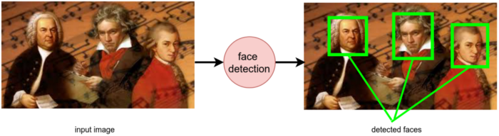
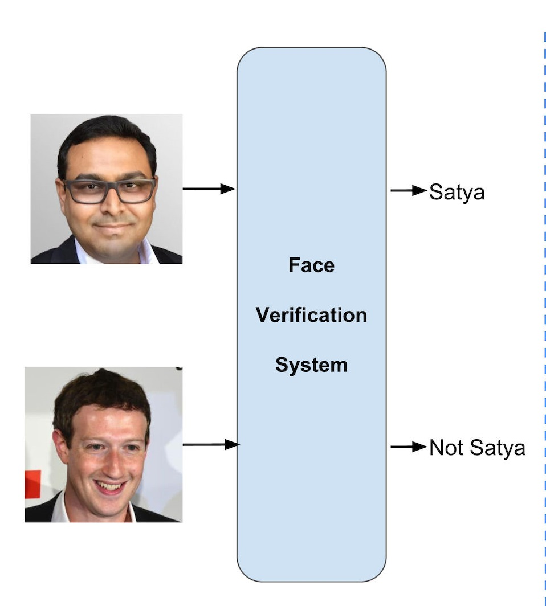
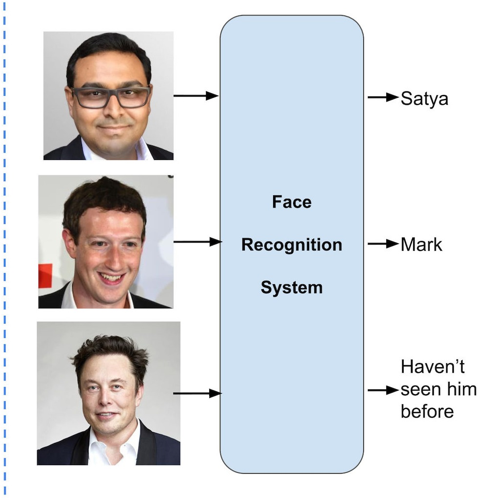
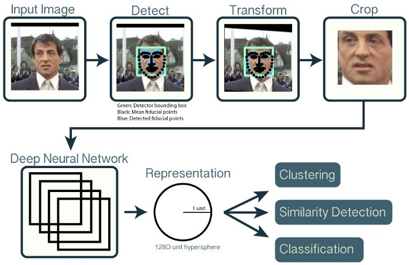

# Application description
Many people care about their safety. Nobody wants his information to be with strangers. Especially if it's important information.

Every day people download tons of files to their smartphones. It can be like ordinary books and videos or important documents and contracts that can affect the fate of not only one person, but also the whole company. It is not safe to store such documents in the default downloads application. It would be prudent to protect such documents more securely. This is the main purpose of this application. To access your documents, you must enter a password or scan a face.

**Note**: all files will be lost if you delete the app. The option to move files back will be added in the next version.
# Work demonstration
Please click the image to see the video of work demonstration

# Installation
- Go to **build/app/outputs/flutter-apk/** folder
- Install **app-release.apk**

# Application details
## Face detection vs face verification
First of all, let’s see what does **“face detection”** and **“face verification”** mean. While many people use both terms interchangeably, they are actually two very different problems.

**Face Detection**, in short is: given an input image, to decide if there are people’s faces present in that image. And for each present face, to know where each face is located (e. g. a bounding box that encloses it) and possibly, also to know the position of the eyes, the nose, the mouth (known as face landmarks).

**Face verification**: we want to compare two faces and answer the question whether faces are same or not. Face detection is part of face verification system. Firstly we need to find face face on an image. The next step is to compare faces using similarity metric.

## Face verification vs face recognition
As I mentioned above in the **face verification** problem, we want to compare two faces and answer the question whether they are the same. In the **face recognition** task, we want to compare the face of a person with all faces in the database and give an answer to the question whether he is present in this database or not.

## How face verification works

- First step, the face is detected on the input image.
- Second, the image is warped using the detected landmarks to align the face
- Third, the face is cropped, and properly resized to feed the Deep Learning model.
- Fourth, the most “juicy part”, is the one depicted as “Deep Neural Network”. I'm going to focus more on this step.

The main idea is that the deep neural network **DNN** takes as input a face **F** and gives as output a **D** =n dimensions vector (of floats). This vector **E** is known as embeddings. This embeedings are created such as the similarity between the two faces **F1** and **F2** can be computed simply as the euclidean distance between the embeddings **E1** and **E2**.

We can now compare two faces **F1** and **F2**, by computing its Similarity, and then check it against some **threshold**. If lower we can say that both faces are from the same person.

# Things to do later
1. Change design
2. Add anti-face spoofing system
3. Store password and face in database
4. Store files in cloud
